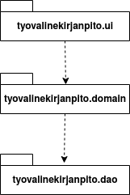
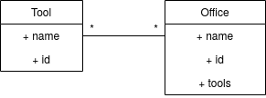
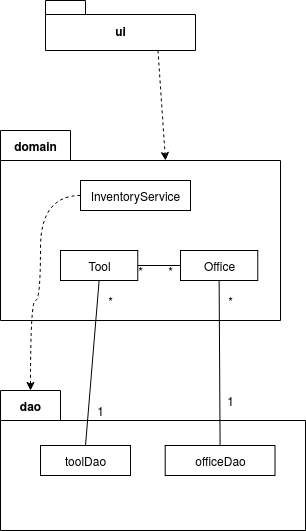
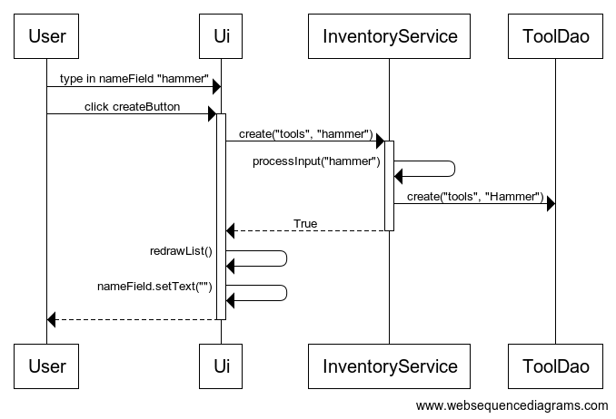

# Arkkitehtuurikuvaus

## Rakenne
Ohjelman rakenne on kolmitasoinen kerrosarkkitehtuuri.

## Käyttöliittymä

Käyttöliittymä sisältää seuraavat näkymät:
* kohteiden listaus (alkunäkymä)
* valitun kohteen tiedot
* uuden kohteen luominen
* valitun kohteen muokkaaminen
* valitun kohteen poistaminen
* kohteen liittäminen (väline toimipisteeseen tai toisin päin)

Sovelluksen vasemmassa reunassa oleva päävalikko pysyy kaiken aikaa samana. Myös ikkunan keskellä on toiminnosta huolimatta lista valitun tyyppisistä kohteista, jota päivitetään tarvittaessa. Sovellusikkunan oikeassa laidassa on osio, jonka sisältöä piirretään uudestaan käyttäjän toimintojen perusteella. Käyttöliittymä on rakennettu ohjelmallisesti luokassa tyovalinekirjanpito.ui.InventoryUI.

## Sovelluslogiikka
Sovelluksen loogisen datamallin muodostavat luokat [Tool](https://github.com/ejronty/ot_harjoitus/blob/master/src/main/java/tyovalinekirjanpito/domain/Tool.java) ja [Office](https://github.com/ejronty/ot_harjoitus/blob/master/src/main/java/tyovalinekirjanpito/domain/Office.java), jotka kuvaavat työvälineitä ja toimipisteitä.

Luokkien rakenteessa oli paljon samaa, joten nämä yhteiset piirteet on siirretty luokkaan [Thing](https://github.com/ejronty/ot_harjoitus/blob/master/src/main/java/tyovalinekirjanpito/domain/Thing.java), jonka molemmat perivät.

Varsinaisesta sovelluslogiikasta vastaa luokka [InventoryService](https://github.com/ejronty/ot_harjoitus/blob/master/src/main/java/tyovalinekirjanpito/domain/InventoryService.java).
Ohjelman rakennetta havainnollistava pakkauskaavio:

## Tietojen pysyväistallennus

Sovellus käyttää SQLite tietokantaa tietojen pysyväistallennukseen. Tiedon tallentamista varten on luokat [SqlToolDao](https://github.com/ejronty/ot_harjoitus/blob/master/src/main/java/tyovalinekirjanpito/dao/SqlToolDao.java) ja [SqlOfficeDao](https://github.com/ejronty/ot_harjoitus/blob/master/src/main/java/tyovalinekirjanpito/dao/SqlOfficeDao.java). Kuten datamalli-luokkienkin kanssa, myös dao-luokkien yhteiset toiminnot on eriytetty omaksi luokakseen [SqlThingDao](https://github.com/ejronty/ot_harjoitus/blob/master/src/main/java/tyovalinekirjanpito/dao/SqlThingDao.java), jonka molemmat spesifimmät luokat perivät.

Sovelluslogiikka tuntee dao-luokista vain rajapinnat, joten dao-luokkien toteutusta on mahdollista muuttaa. Sovelluksen testaamisessä hyödynnetäänkin vain keskusmuistia käyttäviä dao-implementaatioita, jotka toteuttavat samat rajapinnat.

## Päätoiminnallisuuksia
Sekvenssikaavioita sovelluksen toiminnoista

### Uuden työvälineen lisääminen
Käyttäjä on ensin avannut lomakkeen uuden työvälineen luomiselle. Seuraavassa sekvenssikaaviossa näkyy lomakkeen täyttö, ja mitä tapahtuu, kun käyttäjä painaa 'luo' nappia. Listan uudelleenpiirtoa ei esitetty.

