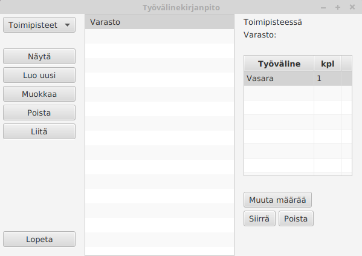

# Käyttöohje

Lataa tiedostot [tyovalinekirjanpito.jar](https://github.com/ejronty/ot_harjoitus/releases/tag/Viikko7)
ja [config.properties](https://github.com/ejronty/ot_harjoitus/releases/tag/Viikko7) 

## Konfigurointi

Ohjelma olettaa, että suoritushakemistosta löytyy tiedosto config.properties, jossa määritetään tietokannan sijainti. Esimerkiksi seuraavasti:
```
dbPath=inventory.db
```

## Ohjelman käynnistäminen

Ohjelma käynnistetään komennolla
```
java -jar tyovalinekirjanpito.jar
```

## Alkunäkymä

Ohjelman aloitusnäkymä on lista työvälineistä, tai tyhjä lista, jollei työvälineitä ole vielä lisätty.
Vasemman yläreunan pudotusvalikosta voi valita, käsitelläänkö työvälineitä vai toimipisteitä.


## Uuden työvälineen / toimipisteen luominen

Ohjelmaan saa luotua uuden kohteen painamalla vasemman reunan päävalikosta nappia 'Luo uusi'.
Avautuu näkymä, johon voi antaa uuden kohteen nimen. Vasemman reunan pudotusvalikko määrää, kumman tyyppinen kohde luodaan. Työvälineen tapauksessa voi määritetään myös, onko kyseessä kuluva työväline. Esimerkkinä vasara ei kulu käytettäessä, mutta naulat kuluvat.


Jos välineen luominen onnistui, päivittyy ikkunan keskellä oleva lista.


## Kohteen nimen muuttaminen

Jos kohdetta luodessa sattui virhe, voi kohteen nimeä muuttaa valitsemalla kohteen listasta ja painamalla nappia 'Muokkaa'. Avautuu näkymä, johon voi syöttää kohteelle uuden nimen. Työvälineen tapauksessa voi myös vaihtaa tietoa kuluvuudesta.


Jos muutos onnistui, katoaa muokkauslomake, ja lista päivittyy.

## Kohteen poistaminen

Kohteen voi poistaa ohjelmasta valitsemalla sen listasta ja painamalla päävalikon nappia 'Poista'.
Avautuu näkymä, jossa käyttäjä voi varmistaa poiston.


## Työvälineen liittäminen toimipisteeseen

Liittääkseen työvälineen toimipisteeseen käyttäjän on valittava listasta työväline, ja painettava päävalikon nappia 'Liitä'.
Avautuu näkymä, jossa on lista toimipisteistä, jotka eivät vielä sisällä kyseistä työvälinettä. Näkymässä on myös kenttä, johon käyttäjä voi syöttää lukumäärän liitettävälle työvälineelle.


Tästä uudesta listasta valitaan haluttu toimipiste, ja painetaan 'Valitse'. Jos liitos onnistui, aukeaa näkymä, jossa on lista kaikista toimipisteistä, joihin työväline on liitetty, ja välineen lukumääristä näissä toimipisteissä.
Prosessi toimii hyvin samankaltaisesti myös toimipisteiden näkymästä.

## Kohteen tietojen näyttäminen

Kohteen tiedot (liitetyt työvälineet tai toimipisteet) saa näkyviin valitsemalla kohteen listasta. Tiedot saa näkyviin myös painamalla päävalikon nappia 'Näytä'.


## Työvälineen poistaminen toimipisteestä

Työvälineen saa poistettua toimipisteestä näyttämällä työvälineen tiedot, valitsemalla poistettavan toimipisteen ja painamalla 'Poista valittu'. Kohteen tiedot näyttävä lista päivittyy merkiksi, että poisto on onnistunut.

## Työvälineen määrän muutokset

Työvälineen määrää saa muutettua valitsemalla työvälineen toimipisteen näkymstä. Tällöin näkyviin tulee uusia toimintoja.



Näiden painikkeiden avulla voi muuttaa työvälineen lukumäärää toimipisteellä, siirtää työvälineitä toimipisteeltä toiselle tai poistaa työvälineen toimipisteeltä.


